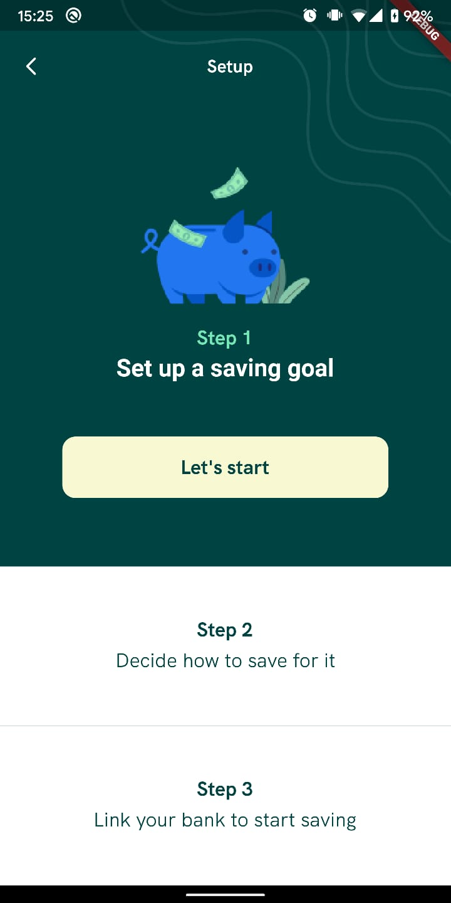
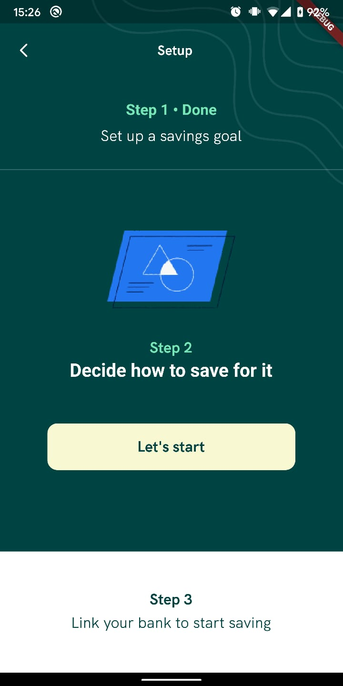
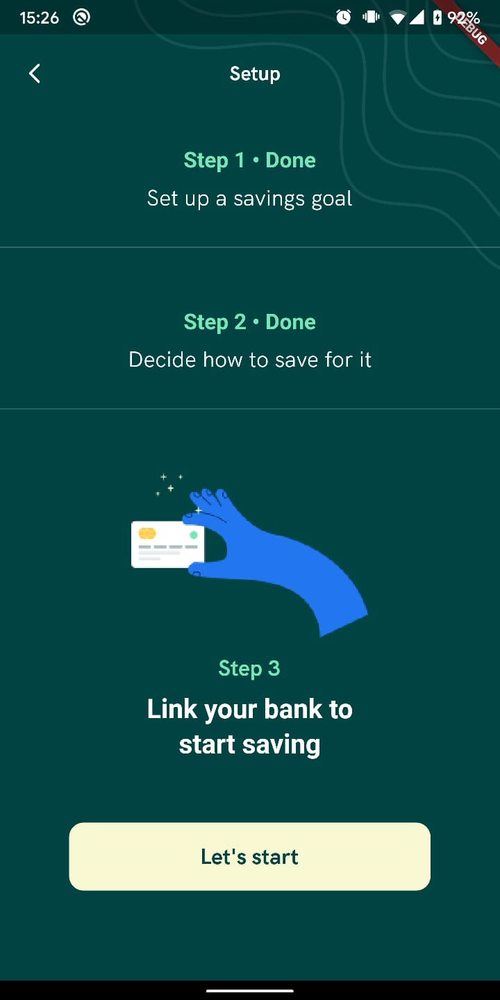
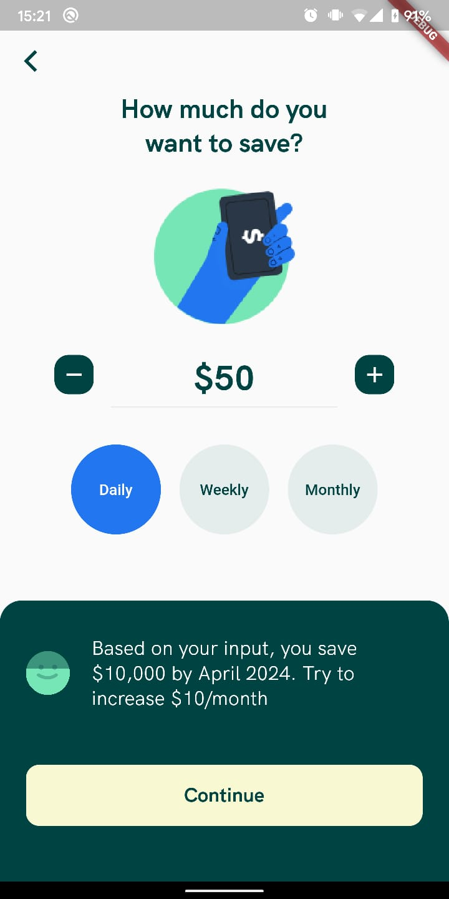
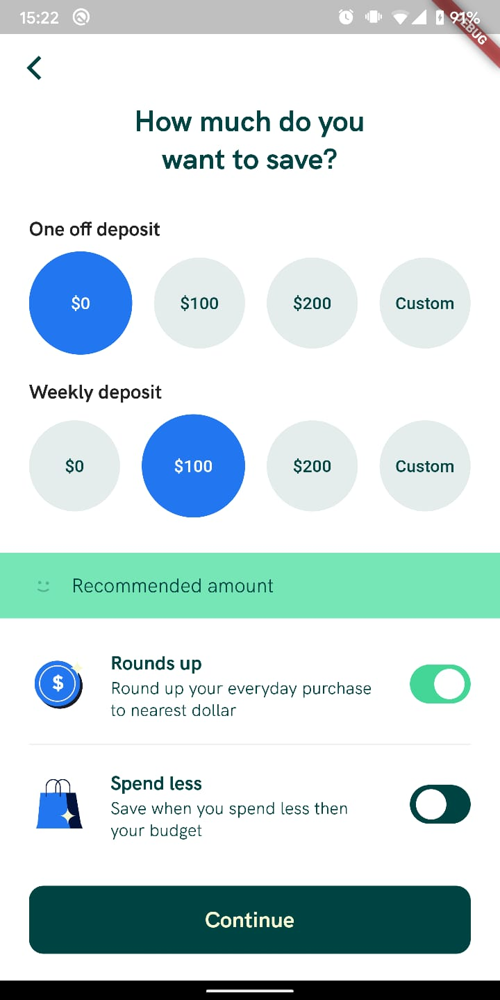
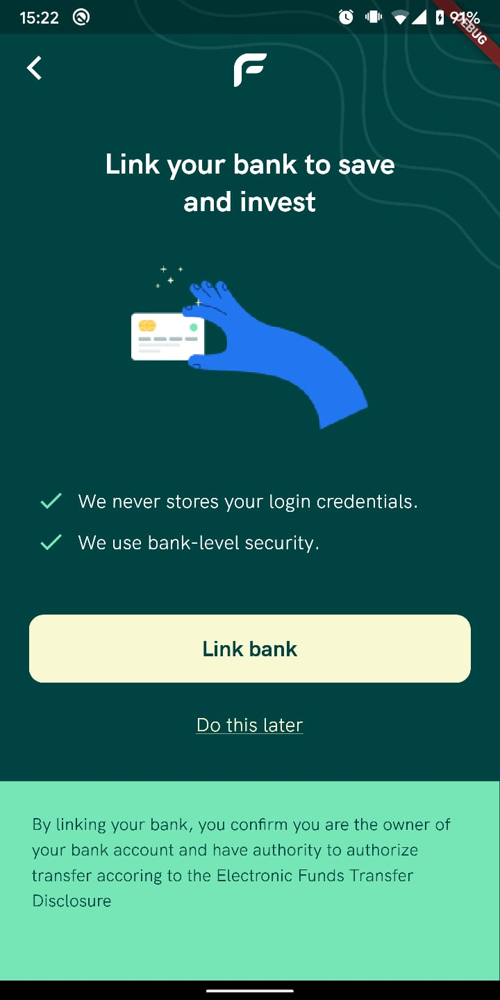
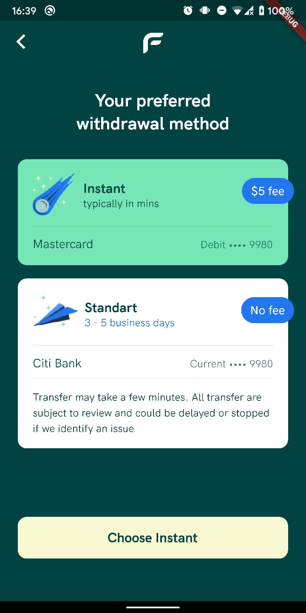

# project-prints

## Investment UI

> Private project.

  
  
  
  

  
  
  

## Entertainment App

  

> https://github.com/feMoraes0/entertainment-app.git

  
  
  

## Clima App
> https://github.com/feMoraes0/clima-app.git

  
  

