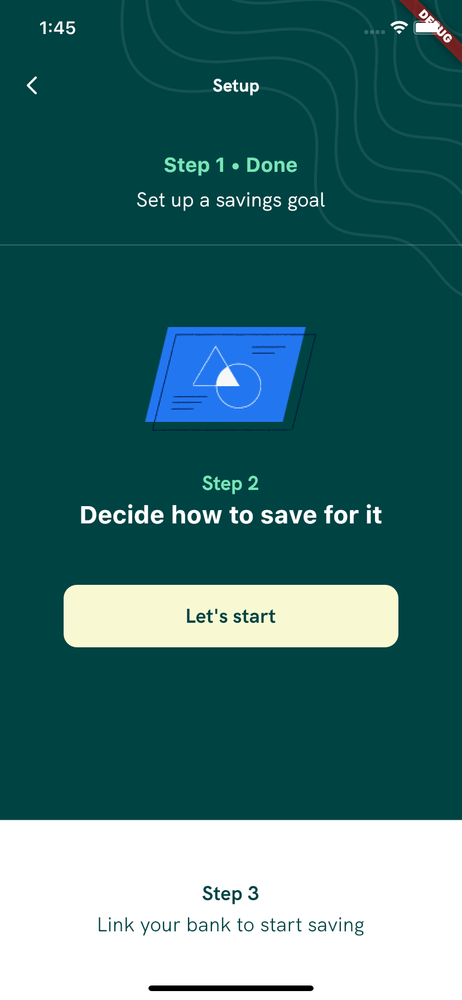
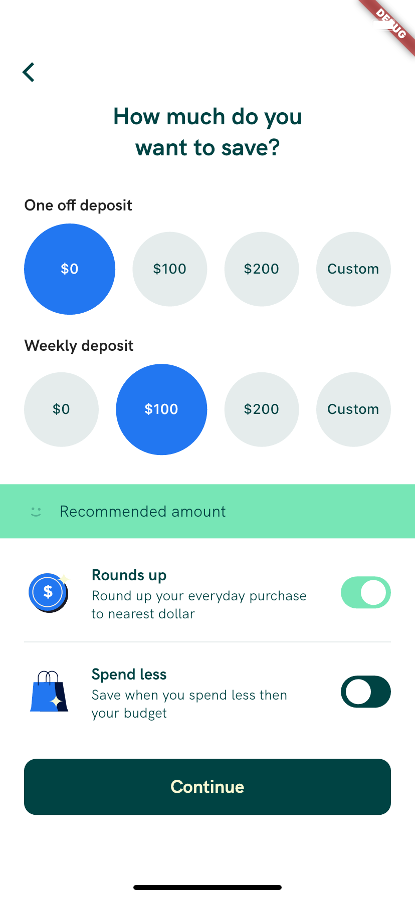

# project-prints

## Animated Stack
> https://github.com/feMoraes0/animated-stack.git

  

## Clima App
> https://github.com/feMoraes0/clima-app.git

  
  

## Entertainment App

  

> https://github.com/feMoraes0/entertainment-app.git

  
  
  

## Investment UI
> Private project.

  
  
  
  

  
  
  
  

  
  
  

## Media Dashboard
> https://github.com/feMoraes0/media-dashboard.git

  
  

## Pokemon App
> https://github.com/feMoraes0/pokemon-app.git

  

